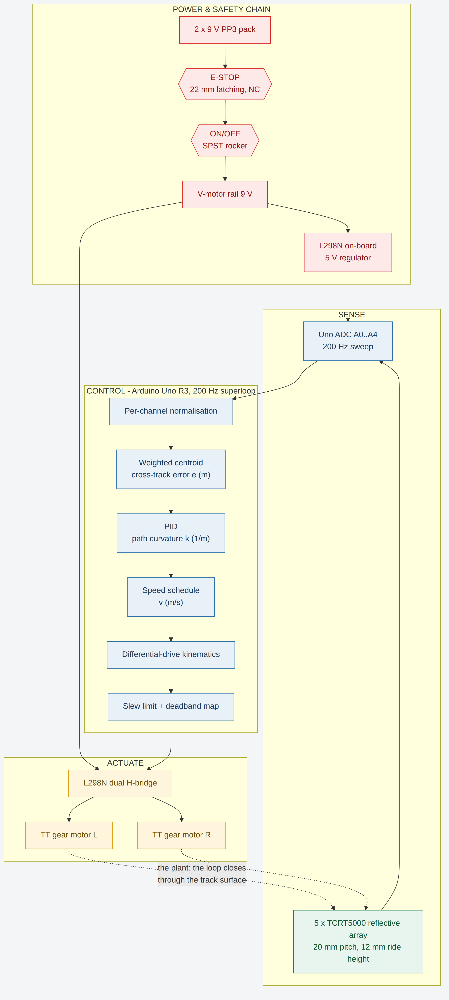
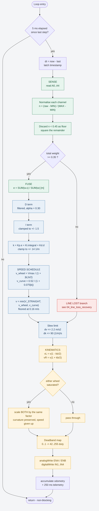
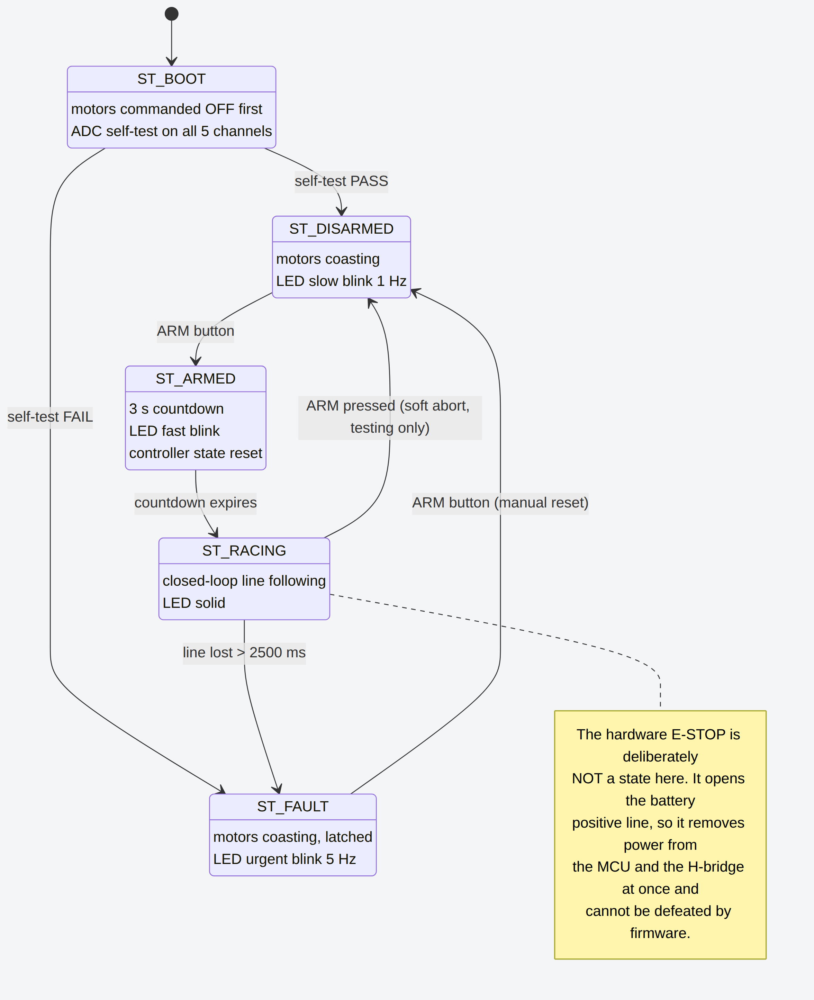
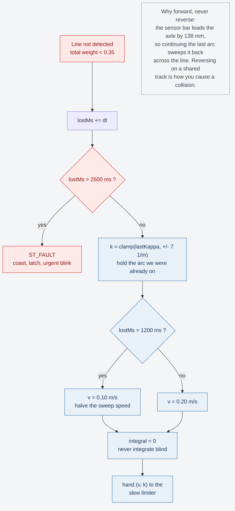
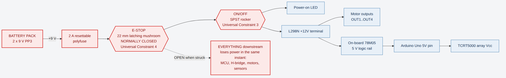

# Folder A — Programming methods, frameworks and design

**Team CO Coders · Lightning McQueen · Robo Rumble 2026 · Robo Grand Prix**

This document states the programming methods and frameworks we use, derives the
control law, and presents the flowcharts. The code it describes lives in
`firmware/` and `simulation/`.

---

## 1. Framework and toolchain

| Layer | Choice | Why |
|---|---|---|
| Target | **Arduino Uno R3 (ATmega328P, 16 MHz)** | 8-bit AVR with a hardware ADC on 6 channels and two independent 8-bit PWM timers. Enough for a 200 Hz loop with 90 % headroom, and universally available in South Africa. |
| Language | **C++ (Arduino core)** | No RTOS, no dynamic allocation, no `String`. The whole program is statically sized and there is no heap to fragment mid-race. |
| Structure | **Non-blocking fixed-rate superloop + finite state machine** | Deterministic period, no `delay()` anywhere in the race path, and a supervisor that can only be in one of five well-defined states. |
| Simulation | **Webots 2023b**, e-puck differential-drive model, C++ controller API | Lets us tune a control law against real differential-drive kinematics before any hardware exists. |
| Circuit | **Wokwi** | Validates the pin map and the H-bridge logic without magic smoke. |

**Deliberate non-choices.** No PID library — we need the integral clamped and
frozen during line loss, which the common libraries do not expose. No
`AccelStepper`/`Servo` — these are DC gearmotors. No FreeRTOS — a 5 ms
superloop with one job does not need a scheduler, and a scheduler would add
jitter we cannot measure on an Uno.

---

## 2. System architecture



The loop closes through the track surface: the motors move the car, the car
moves the sensor bar, the sensor bar reports a new error. Everything between is
software.

---

## 3. The control law, derived

### 3.1 Why curvature and not "PWM difference"

The naive line follower computes an error and adds it to one motor's PWM and
subtracts it from the other. That works, but the gain that feels right at low
speed oversteers at high speed, because the same PWM difference produces a much
tighter turn when the car is moving slowly and a much wider one when it is
moving fast. You end up tuning one set of gains per speed.

We instead have the PID output a **path curvature** κ, in units of 1/m. κ is a
property of the *path*, not of the throttle: κ = 1/R where R is the turn radius.
For a differential-drive vehicle with wheel separation *b*:

```
v_left  = v · (1 − κ·b/2)
v_right = v · (1 + κ·b/2)
```

A demand of κ = 5 1/m is a 200 mm radius turn at 0.2 m/s and a 200 mm radius
turn at 0.5 m/s. One set of gains, every speed.

### 3.2 The error signal

Five TCRT5000 channels at 20 mm pitch, at lateral offsets
x = {−40, −20, 0, +20, +40} mm. Each channel is normalised against its **own**
calibration — the five devices differ measurably in LED output and
phototransistor gain, so a single global threshold throws away resolution:

```
n_i = clamp( (raw_i − MIN_i) / (MAX_i − MIN_i), 0, 1 )
```

Channels below `ON_LINE_FRACTION` (0.45) are floor and are discarded. What
remains is squared — this sharpens the centroid against stray reflections — and
used as a weight:

```
w_i = ((n_i − 0.45) / 0.55)²
e   = Σ(w_i · x_i) / Σ(w_i)          [millimetres, then converted to metres]
```

This is the one place where the firmware improves on the Webots prototype. The
simulator had three binary sensors, so its error could only take the five values
{−1, −0.5, 0, +0.5, +1}. Those discrete steps are what forced such heavy
derivative filtering in the simulation. Five analog channels give a continuous
error, so the derivative term is usable.

### 3.3 PID

```
κ = Kp·e + Ki·∫e dt + Kd·ė
```

with `Kp = 34`, `Ki = 0.35`, `Kd = 1.30`, and κ clamped to ±14 1/m (a 71 mm
minimum radius, tighter than any corner we expect).

Three details that matter more than the gain values:

- **The derivative is low-pass filtered** (α = 0.30). The ADC noise floor is a
  couple of LSB; raw differentiation would put that straight into the motors.
- **The integral is clamped** to ±1.5 and **frozen while the line is lost**.
  Integrating blind is how a recovering car drives itself off the track.
- **The integral only accumulates while tracking.** A long corner cannot wind it
  up into an overshoot on the following straight.

### 3.4 The speed schedule — where the time is won

Speed is chosen *from the curvature the controller is about to demand*, before
that curvature is applied. Two independent ceilings, take the lower of the two:

```
v_wheel = V_MAX / (1 + |κ|·b/2)          # the outer wheel saturates here
v_curve = V_STRAIGHT / (1 + 0.075·|κ|)   # grip and tracking-margin comfort limit
v       = max(V_FLOOR, min(V_STRAIGHT, v_wheel, v_curve))
```

`v_wheel` is not a tuning parameter — it is arithmetic. At curvature κ the outer
wheel must run at `v·(1 + κ·b/2)`, so any faster and the wheel is clipped, the
actual curvature is not what was asked for, and the car runs wide. `v_curve` is
the tunable one, and 0.075 came out of the Webots sweep in
`../Folder B/Simulation/SIMULATION.md`.

The sensor bar leads the drive axle by 138 mm, so by the time the error rises,
the car has 138 mm of travel in which to shed speed. At 0.52 m/s and a 2.2 m/s²
slew limit that is enough to reach corner speed before the axle reaches the
corner. **This is the "tweak of our own" the concept notes referred to.**

### 3.5 Saturation handling

If either wheel would exceed its maximum, **both** are scaled by the same
factor:

```
s = ω_max / max(|ω_L|, |ω_R|);   ω_L·= s;   ω_R·= s
```

This preserves the ratio between the wheels, and therefore the path curvature.
The car still takes the corner on the radius it asked for — it just takes it
slower. Clamping only the fast wheel would change the radius and run the car
wide, which is the classic way a fast line follower loses a corner.

---

## 4. The main control loop



**Timing budget at 200 Hz (5 ms):**

| Stage | Cost |
|---|---|
| 5 × `analogRead()` | ~520 µs (104 µs per conversion) |
| Normalise, centroid, PID, schedule | ~180 µs (float maths on an AVR) |
| Kinematics, slew, deadband, PWM writes | ~60 µs |
| **Total** | **~760 µs — 15 % of the period** |

The remaining 85 % is headroom. Telemetry runs at 4 Hz and is the only thing
that ever touches the serial port.

---

## 5. Supervisory state machine



Five states, and the motors are commanded off in `setup()` before anything else
runs — including before the pin modes are set, so a brown-out reset cannot leave
a wheel driven.

The **E-Stop is deliberately not a state**. It opens the battery positive line,
which removes power from the MCU and the H-bridge in the same instant. Modelling
it in firmware would imply software could observe or override it; it cannot, and
that is the point.

`ST_FAULT` latches. A car that has lost the line and stopped does not restart
itself — a human presses ARM.

---

## 6. Line-loss recovery



The car **always continues forward** and never reverses. Two reasons:

1. The sensor bar leads the axle by 138 mm. Continuing the arc the car was
   already on sweeps the bar back across the line — geometrically, that is where
   the line is.
2. Reversing on a shared track is how you cause a collision with a car behind
   you.

After 1200 ms the sweep speed halves; after 2500 ms the car enters `ST_FAULT`
and stops. Stopping is the correct failure mode for an autonomous racer: a
stationary car is a hazard a marshal can deal with, a car searching at speed is
not.

---

## 7. Power and safety chain in software terms



There is nothing for software to do here, and that is the design. The full
electrical drawing is in `../Folder B/Schematics/01_power_safety_chain.svg`.

---

## 8. Category alignment

Robo Grand Prix is autonomous racing. This firmware:

- has **no radio, Wi-Fi, Bluetooth or serial command path** — `Serial` is
  written to and never read;
- takes exactly one human input, the ARM button, pressed before the run;
- follows a line and manages speed — there is no weapon code, no combat logic,
  no teleoperation, and nothing from another category.

---

## 9. File map

```
Folder A/
├── PROGRAMMING.md                       this document
├── firmware/
│   ├── lightning_mcqueen/
│   │   ├── lightning_mcqueen.ino        200 Hz superloop + state machine
│   │   └── config.h                     every tunable, each one traceable
│   └── calibration/
│       └── calibration.ino              sensor / trim / deadband measurement
├── simulation/
│   └── robograndprix_sim.cpp            Webots controller (control-law origin)
└── flowcharts/
    ├── 01_system_architecture.mmd/.png
    ├── 02_main_control_loop.mmd/.png
    ├── 03_state_machine.mmd/.png
    ├── 04_line_loss_recovery.mmd/.png
    └── 05_safety_power_chain.mmd/.png
```

Flowchart sources are Mermaid. GitHub renders them inline; the PNGs are provided
for the pitch deck and for offline reading.
