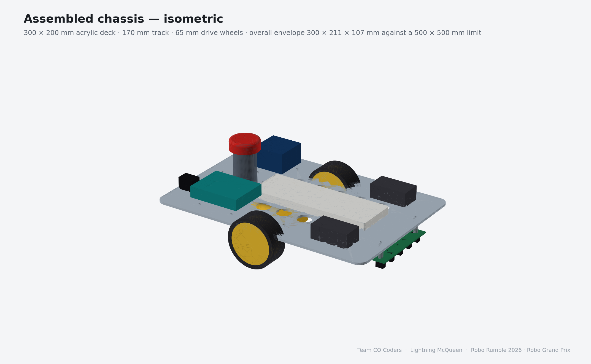
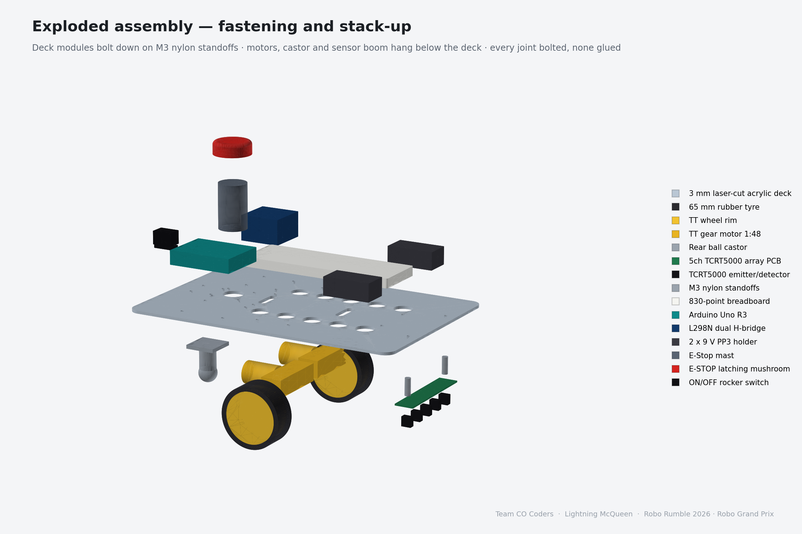
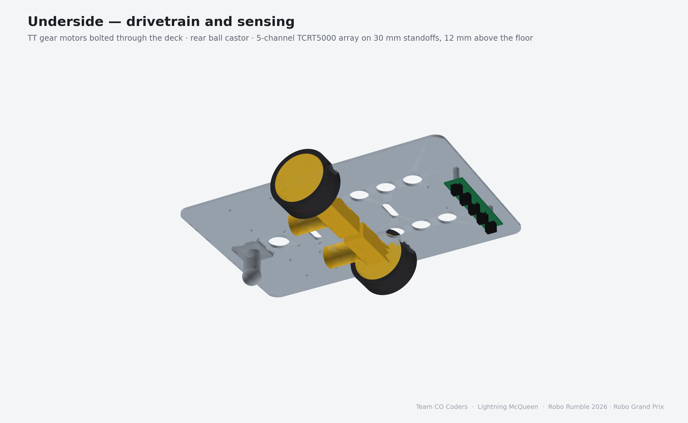
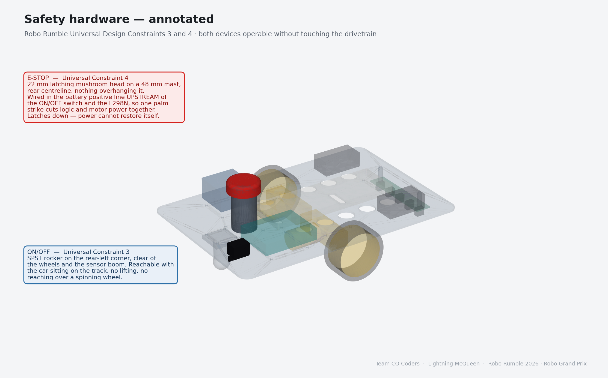
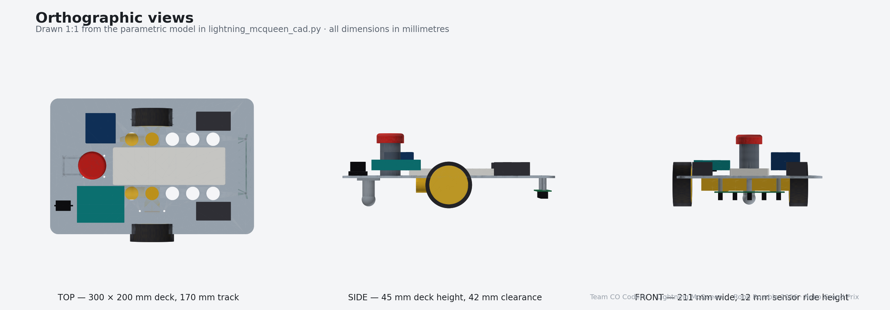

# Mechanical Design

**Team CO Coders · Lightning McQueen · Robo Rumble 2026 · Robo Grand Prix**

---

## 1. The design at a glance



A single 3 mm laser-cut acrylic deck, 300 × 200 mm, carrying everything. The
830-point breadboard sits on top on the centreline; the Arduino and the L298N
flank it; the battery pack sits forward. Two TT gear motors bolt through the
deck from below at mid-wheelbase, a ball castor supports the tail, and the
sensor boom hangs off the nose on nylon standoffs.

| | |
|---|---|
| Overall envelope | **300 × 211 × 107 mm** (limit: 500 × 500 mm) |
| Deck | 300 × 200 × 3 mm cast acrylic |
| Track (wheel centres) | 170 mm |
| Wheelbase (axle to castor) | 118 mm |
| Ground clearance under the deck | 42 mm |
| Sensor ride height | 12 mm above the floor |
| Sensor lead ahead of the drive axle | 138 mm |
| Estimated assembled mass | **0.86 kg** (limit: below 5 kg) |

The width comes out at 211 mm rather than 200 mm because the wheels sit 5.5 mm
proud of the deck on each side. That is intentional: it keeps the tyres clear of
the deck edge so a brush against a barrier hits rubber, not acrylic.

---

## 2. Fabrication method

**The deck is laser cut, not drilled.** `CAD/deck_plate_laser_cut.dxf` is a 1:1
flat profile containing the outline, all 34 M3 clearance holes, the 22.5 mm
E-Stop bore, the lightening holes and the two cable slots. It goes to the cutter
as-is. Nothing on this vehicle is marked out and drilled by hand, because
hand-drilled acrylic chips and hand-marked hole patterns do not repeat.

| Part | Method | Material |
|---|---|---|
| Deck plate | Laser cut from the supplied DXF | 3 mm cast acrylic |
| E-Stop mast | 3D printed, 30 mm dia × 48 mm, 4 perimeters, 40 % infill | PLA |
| Sensor boom standoffs | Off-the-shelf | M3 × 30 mm nylon hex standoffs |
| Deck module standoffs | Off-the-shelf | M3 × 8 mm nylon hex standoffs |
| Motor brackets | Off-the-shelf, supplied with the TT motors | ABS |
| Fasteners throughout | Off-the-shelf | M3 × 10 mm pan-head, nyloc nuts |

**Why acrylic rather than 3D printing the whole chassis.** A printed monocoque
looks better in renders, but a 300 mm printed part warps, takes eight hours, and
cannot be re-cut in an afternoon when a mounting hole turns out to be 4 mm out.
A laser-cut flat plate takes ninety seconds on the machine and is dimensionally
exact. For a competition where the schedule is the real constraint, that matters
more than the aesthetics.

**Why 3 mm and not 5 mm.** 3 mm cast acrylic spanning 300 mm with the load
concentrated at the motor mounts deflects about 0.4 mm at the nose under the
assembled mass — well inside the ±2 mm the sensor ride height tolerates. Going to
5 mm would add 240 g for stiffness we do not need.

---

## 3. Fastening and assembly



**Every joint on this vehicle is bolted. Nothing is glued.** Adhesive joints in
acrylic are brittle, they cannot be adjusted, and when a sensor turns out to be
2 mm too low there is no way back. Bolted joints come apart.

The stack-up, from the ground up:

1. **Wheels** press onto the TT motor D-shafts.
2. **TT motors** bolt to the underside of the deck through the ABS brackets,
   two M3 per side, at X = 150 mm from the tail.
3. **Ball castor** bolts to the underside at the tail on a 24 mm square M3
   pattern.
4. **Sensor boom** hangs on two M3 × 30 mm nylon standoffs at X = 288 mm,
   ±40 mm either side of the centreline. Nylon, not steel, because the standoffs
   sit directly beside the IR emitters and a steel post reflects.
5. **Breadboard** sits on the deck centreline on 8 mm standoffs, four M3.
6. **Arduino Uno** and **L298N** bolt down on 8 mm standoffs on either flank,
   four M3 each.
7. **Battery holders** are strapped forward with hook-and-loop, so a flat pack
   is a ten-second swap between heats rather than an unbolting job.
8. **E-Stop mast** bolts down on a 4 × M3 circle on a 22 mm radius, over the
   22.5 mm bore that passes the button body through the deck.

### Adjustment designed in

- **Sensor ride height** is set by the standoff length. If the track surface
  reads badly at 12 mm, an M3 × 25 or M3 × 35 standoff moves it without
  re-cutting anything.
- **Weight distribution** is set by where the battery straps sit. Moving the
  pack rearward shifts load onto the drive wheels for grip; forward reduces
  castor scrub.
- **Motor position** is fixed. This is the one dimension we do not want anyone
  adjusting between heats — it sets the sensor lead, which the speed schedule
  depends on.

---

## 4. Underside — drivetrain and sensing



The two TT gearboxes point inboard from the wheels and very nearly meet on the
centreline, which is the standard dual-TT arrangement and keeps the mass low and
central. The castor carries perhaps 15 % of the mass; the rest sits over the
drive wheels, which is where it is useful.

The sensor boom is the part most likely to be damaged, so it is the part that is
easiest to replace: two standoffs, two bolts, and it is off.

---

## 5. Safety hardware — Universal Design Constraints 3 and 4



**E-Stop (Constraint 4).** A 22 mm latching mushroom head on a 48 mm printed
mast at the rear centreline. It is the tallest object on the car and nothing
overhangs it, so it can be struck from above or from behind with an open palm
while the car is moving. It latches down: power cannot restore itself until an
operator twists the head back out. Electrically it is the *first* device in the
battery positive line — see `../Schematics/01_power_safety_chain.svg`.

**ON/OFF (Constraint 3).** An SPST rocker at the rear-left corner of the deck,
clear of the wheels and of the sensor boom. It is operable with the car sitting
on the grid — no lifting, no tilting, and no reaching across a wheel that is
about to spin.

Both are at the rear because that is the end an operator approaches from. The
E-Stop is on the centreline and raised; the ON/OFF is in the corner and flush.
They are not confusable by feel.

---

## 6. Orthographic views



Drawn 1:1 from the parametric model.

---

## 7. Mass budget

| Item | Qty | Unit (g) | Total (g) |
|---|---:|---:|---:|
| 3 mm acrylic deck, 300 × 200 mm, holed | 1 | 198 | 198 |
| TT gear motor 1:48 | 2 | 30 | 60 |
| 65 mm wheel | 2 | 30 | 60 |
| Ball castor assembly | 1 | 28 | 28 |
| Arduino Uno R3 | 1 | 25 | 25 |
| L298N module | 1 | 30 | 30 |
| 830-point breadboard | 1 | 90 | 90 |
| 5-channel TCRT5000 array | 1 | 12 | 12 |
| 9 V PP3 alkaline | 2 | 46 | 92 |
| Battery holders and straps | 2 | 14 | 28 |
| E-Stop button + printed mast | 1 | 62 | 62 |
| Rocker switch, fuse, LEDs, buzzer | — | — | 22 |
| Standoffs, bolts, nuts (≈60 pieces) | — | — | 68 |
| Wiring loom | — | — | 80 |
| **Total** | | | **855 g** |

**0.86 kg against a 5 kg limit.** We are at 17 % of the allowance, which is the
point of the light-material approach: less mass on the wheels means the same TT
gearboxes accelerate harder and the same tyres hold a tighter corner. The
batteries are the heaviest single line item at 92 g, which is exactly why two
9 V PP3 cells were chosen over twelve 1.5 V AA cells (≈276 g).

---

## 8. Files in this folder

```
Mechanical Design/
├── MECHANICAL_DESIGN.md              this document
├── CAD/
│   ├── lightning_mcqueen_cad.py      the parametric model — edit the
│   │                                 PARAMETERS block and re-run
│   ├── render_views.py               generates everything in renders/
│   ├── deck_plate_laser_cut.dxf      1:1 flat profile for the laser cutter
│   ├── lightning_mcqueen_assembly.step   full coloured assembly
│   ├── STEP/                         one .step per part (Fusion / SolidWorks)
│   └── STL/                          one .stl per part (printing, meshing)
└── renders/
    ├── 01_isometric.png
    ├── 02_exploded.png
    ├── 03_orthographic.png
    ├── 04_safety_annotated.png
    └── 05_underside.png
```

The model is parametric. Changing `TRACK` or `WHEEL_D` at the top of
`lightning_mcqueen_cad.py` and re-running regenerates every STEP, STL, the DXF
and all five renders consistently. The build script also asserts the 50 × 50 cm
footprint rule on every run and fails loudly if a change ever breaks it.
