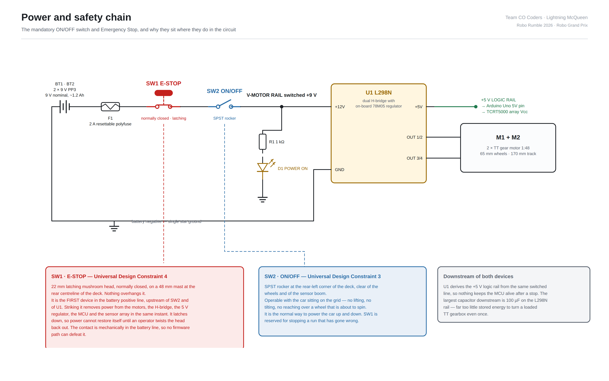
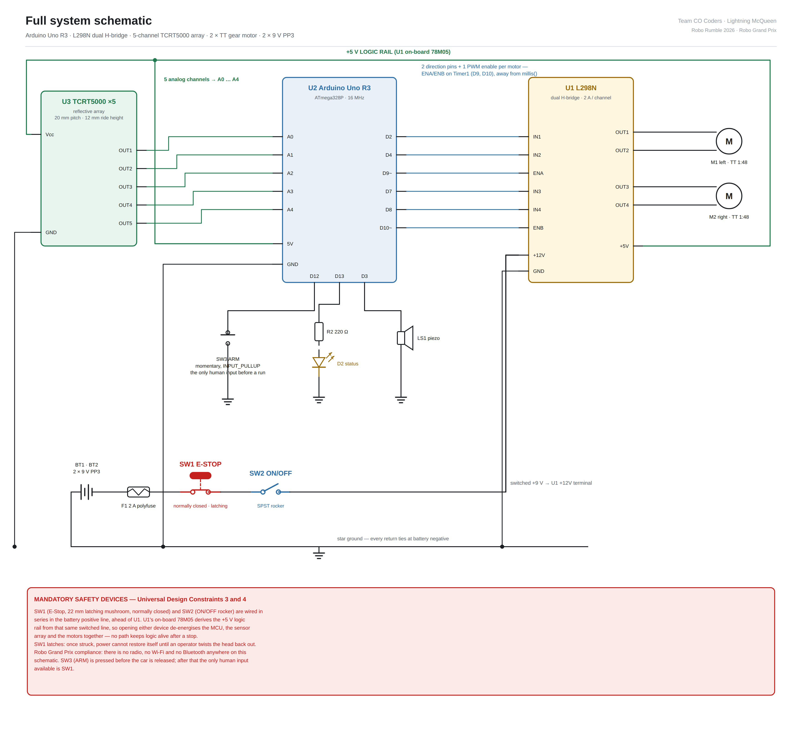

# Schematics

**Team CO Coders · Lightning McQueen · Robo Rumble 2026 · Robo Grand Prix**

Two drawings. The first is the safety-critical power path on its own, because
Universal Design Constraints 3 and 4 deserve a drawing where nothing competes
for attention. The second is the complete system.

Both are generated by `draw_schematics.py` — run it and you get identical files
back. SVG is the master; PNG is provided for the pitch deck and for readers
without an SVG viewer.

---

## 1. Power and safety chain — Constraints 3 and 4



### The chain, in order

```
BT1/BT2  →  F1  →  SW1 (E-STOP)  →  SW2 (ON/OFF)  →  U1 (L298N)  →  motors
2 × 9 V     2 A     latching NC       SPST rocker      +12V           M1, M2
                                                          ↓
                                                   78M05 → +5 V rail
                                                          ↓
                                              Arduino Uno · TCRT5000 array
```

### SW1 — Emergency Stop (Universal Design Constraint 4)

| | |
|---|---|
| Device | 22 mm latching mushroom-head pushbutton, **normally closed** |
| Location | Rear centreline of the deck, on a 48 mm mast — the tallest object on the car, nothing overhanging it |
| Position in circuit | **First device in the battery positive line**, upstream of SW2 and of U1 |
| Action | Struck from above or behind with an open palm. Latches down. |
| Reset | Twist the head to release — cannot restore itself |

**Why it is placed first.** Everything on this vehicle draws from one switched
rail. U1's on-board 78M05 derives the 5 V logic supply from the same line that
feeds the motors, so opening SW1 removes power from the motors, the H-bridge,
the regulator, the MCU and the sensor array **in the same instant**. There is no
sequencing, no software involvement and no state to unwind.

**Why it cannot be defeated.** The contact is mechanically in series with the
battery. No firmware path can bridge it, because there is no firmware left
running once it opens.

**Why residual energy is not a hazard.** The largest capacitor downstream is the
100 µF bulk cap on the 5 V rail, storing 1.25 mJ. Turning a loaded TT gearbox
through one revolution needs on the order of a joule — roughly a thousand times
more. The car cannot creep after a stop.

### SW2 — ON/OFF (Universal Design Constraint 3)

| | |
|---|---|
| Device | SPST rocker |
| Location | Rear-left corner of the deck, clear of the wheels and of the sensor boom |
| Position in circuit | Second in the battery positive line, immediately after SW1 |
| Access | Operable with the car sitting on the grid — no lifting, no tilting, no reaching across a wheel |

SW2 is the normal way to power the car up and down. SW1 is reserved for stopping
a run that has gone wrong. Placing them both at the rear — the end an operator
approaches from — with the E-Stop raised on the centreline and the rocker flush
in the corner means they are not confusable by feel.

---

## 2. Full system schematic



### Wiring table

| From | To | Signal |
|---|---|---|
| U3 OUT1 … OUT5 | U2 A0 … A4 | 5 analog sensor channels |
| U2 D2, D4 | U1 IN1, IN2 | Motor A direction |
| U2 D9 (Timer1) | U1 ENA | Motor A PWM |
| U2 D7, D8 | U1 IN3, IN4 | Motor B direction |
| U2 D10 (Timer1) | U1 ENB | Motor B PWM |
| U1 OUT1, OUT2 | M1 | Left motor |
| U1 OUT3, OUT4 | M2 | Right motor |
| U1 +5V | U2 5V, U3 Vcc | Derived logic rail |
| U2 D12 | SW3 → GND | ARM button, `INPUT_PULLUP` |
| U2 D13 | R2 220 Ω → D2 → GND | Status LED |
| U2 D3 | LS1 → GND | Piezo buzzer |
| BT1/BT2 + | F1 → SW1 → SW2 → U1 +12V | Switched battery positive |
| All GND | U1 GND pad | Star ground to battery negative |

### Grounding

Single star point at the L298N GND pad, which is the only tie to battery
negative. The sensor array, the Uno and the H-bridge each return there
independently rather than daisy-chaining, so motor current does not share a
conductor with the analog sensor return. On a car where the measurement is an
ADC reading of a phototransistor and the load is a pair of brushed motors, that
separation is what keeps the line position from wobbling every time the motors
change duty.

### Robo Grand Prix compliance, visible on the drawing

There is no radio, no Wi-Fi module, no Bluetooth module and no receiver anywhere
on this schematic. The only human-operable devices are SW1 (E-Stop), SW2
(ON/OFF) and SW3 (ARM, pressed before the car is released). Serial is used for
telemetry out and is never read.

---

## 3. Files

```
Schematics/
├── SCHEMATICS.md                  this document
├── draw_schematics.py             generates both drawings
├── 01_power_safety_chain.svg/.png Constraints 3 and 4, annotated
└── 02_full_system.svg/.png        complete wiring
```

Regenerate with:

```bash
pip install matplotlib          # not required for the SVG, only for the raster fallback
python3 draw_schematics.py
```
